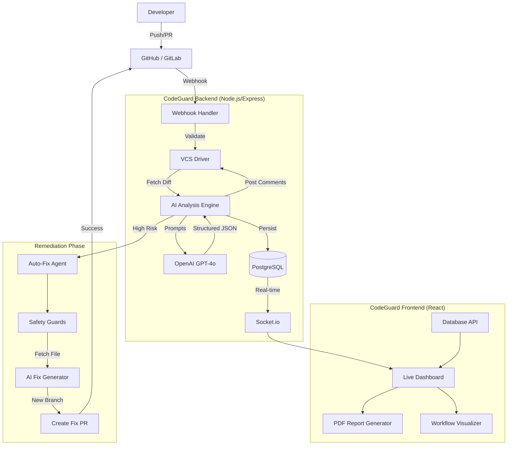

# 🚀 CodeGuard AI — Pipeline & Feature Deep Dive

This document provides a comprehensive technical breakdown of the **CodeGuard AI Agent**, its automated PR review pipeline, and the full suite of features designed for modern AppSec teams.

---

## 🏗️ System Architecture

CodeGuard is built as a high-performance, real-time security agent that sits between your developers and your version control systems (VCS).

---

## 🛠️ The Full Pipeline (Step-by-Step)

### 1. Trigger & Authentication
- **Event Detection:** When a PR is opened, updated, or reopened, GitHub/GitLab sends a webhook.
- **Security Check:** The backend performs a HMAC signature verification (`verifyWebhookSignature`) using the `webhookSecret` unique to each repository.
- **OAuth Context:** Requests to the VCS are made using the specific user's OAuth access token, ensuring compliance with organization permissions.

### 2. Analysis (The "Detection" Phase)
- **Context Fetching:** CodeGuard retrieves the raw diff and metadata (additions, deletions, changed files).
- **AI Orchestration:** The `analyzeCodeDiff` function in `server/openai.ts` constructs a sophisticated prompt that instructs the AI to act as a **Senior Lead App Sec Engineer**.
- **Categorization:** Issues are classified into:
    - 🐞 `Bug`: Logical errors and edge cases.
    - 🔒 `Security`: OWASP vulnerabilities, hardcoded secrets, injection flaws.
    - ⚡ `Performance`: Inefficient loops, memory leaks, blocking operations.
    - 📖 `Readability`: Unclear naming, lack of documentation, complex logic.
- **Risk Assignment:** An overall `Risk Level` (Low, Medium, High) is calculated based on the severity and quantity of detected issues.

### 3. Remediation (The "Auto-Fix" Phase)
- **Safety Guards:** Before generating a fix, the system checks the `Safety Guard` utility to block edits on critical paths (e.g., `auth.ts`, `.env`, `payment-gateway/`).
- **File Retrieval:** The agent fetches the *entire* file content, not just the diff, to understand broader architectural patterns.
- **Secure Code Generation:** The AI generates a complete, refactored replacement file that resolves the primary vulnerability without introducing regressions.
- **Delivery:**
    1. Creates a specialized security branch: `security-fix-PR-{NUMBER}-{RANDOM}`.
    2. Commits the fixed code.
    3. Opens a new Pull Request targeting the developer's original branch.
    4. Posts a pointer comment on the original PR: *"🚨 High-risk security issue detected. A security-fix PR has been created: ➡️ [Link]."*

### 4. Feedback & Visualization
- **Line-by-Line Comments:** Comments are posted directly to the VCS, mapped exactly to the relevant line numbers.
- **Executive Summary:** A high-level summary is posted as a PR comment, including a breakdown of risks.
- **Real-time Dashboard:** All active reviews are streamed to the React dashboard via Socket.io.

---

## 🌟 Core Features

### 1. Multi-Platform Support
- **GitHub:** Deep integration with Octokit (Rest & GraphQL).
- **GitLab:** Full support for Merge Requests and GitLab CI/CD hooks.

### 2. Live Security Dashboard
- **PR Monitoring:** Track every active PR across all connected repositories.
- **Historical Analysis:** Recharts-powered graphs show security trends and risk distributions over time.
- **Live Logs:** Real-time logging of AI analysis steps.

### 3. Security Health Reports (PDF)
- Generate professional, premium-grade PDF reports for stakeholders.
- Includes: Security Health Score, Risk Distribution, Recent Activity Table, and Trend Analysis.

### 4. Configurable Analysis Rules
- Users can toggle specific detection categories (e.g., disable style issues to focus purely on security).
- **Strict Mode:** Enforces higher standards for auto-fix generation.

### 5. AI Fix Flow Visualizer
- A dedicated UI component that provides an animated walkthrough of how the AI detected the bug, applied safety guards, and generated the fix branch.

---

## 🔒 Security & Governance

- **Data Isolation:** Repository secrets and tokens are encrypted at rest.
- **Credential Sanitization:** The AI engine is strictly prompted never to leak or store keys it encounters during analysis.
- **Safety Loops:** No code is pushed to the primary branch; all AI-suggested changes require manual approval via a PR merge.

---

## 🚀 Performance Benchmarks

- **Detection Time:** ~5-12 seconds per diff analysis.
- **Auto-Fix Generation:** ~15-25 seconds for an end-to-end PR creation.
- **Dashboard Latency:** <100ms real-time state synchronization.

---

Developed & Maintained by **CodeGuard Engineering**
